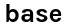

# base-ui-components

> base Angewandte Component Library

This is a [Vue 3](https://vuejs.org/) based component library developed by and used for projects of the
[base Angewandte](https://base.uni-ak.ac.at),
a collection of applications for the staff and students at the [University of
Applied Arts Vienna](https://www.dieangewandte.at).

### Installation and Usage

Install via:
```
npm i base-ui-components
```

and import and use the desired component(s) in your vue file(s):

```vue
Component.vue

<script setup>
  import { BaseButton } from 'base-ui-components';
</script>

<template>
  <BaseButton
    text="Click me!" />
</template>

```

All available components, their usage and demos can be found in our [styleguide](https://base-angewandte.github.io/base-ui-components/).

The code base is available at [GitHub](https://github.com/base-angewandte/base-ui-components).

[Development Instructions](buildSetup.md)

### Customization

App color and certain other styles can be customized via css variables.
In order to do so you can add the following variables to your main css/scss file:

```css
:root {
  --app-color: #FF9800;
  --app-color-secondary: #b085f5;
  --font-color: rgb(0, 0, 0);
  --font-color-second: rgb(107, 107, 107);
  --button-header-color: rgb(240, 240, 240);
  --keyboard-active-color: rgb(217, 217, 217);
  --input-field-color: rgb(200, 200, 200);
  --background-color: #f0f0f0;
  --box-color: #ffffff;

  --uploadbar-color: #999999;
  --switch-checked-color: #4d4d4d;
  --switch-svg-checked-color: #ffffff;
  --graytext-color: rgba(16, 16, 16, 0.3);

  --warning-color: #ff4444;
  --pagination-bullet-color: #444444;

  --base-tooltip-box-threshold-top: 0;
}
```
Then in your `main.js` file import your styles before the base-ui-components file. E.g.:

```js
import './styles/app.scss';

import 'base-ui-components/base-ui-components.css';
```


### License

See [LICENSE](LICENSE.txt)


<!-- logo angewandte -->
{width=200}
<!-- logo base -->

<!-- logo zukunvt?  or anything else? -->

### Support

This open-source project was developed (and more specifically - cross-browser tested) with the support of:
[{width=200}](https://www.browserstack.com)
